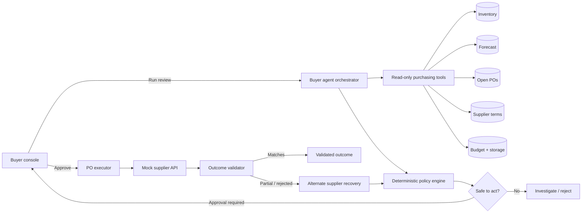

# Atlas — AI Purchasing Agent

Atlas is a full-stack purchasing decision system that investigates evidence, makes a constrained recommendation, takes an approved action, validates the real outcome, and recovers when the supplier response differs from the plan.

The core demo implements **Purchase Recommendation Review** end-to-end and continues into **Supplier Cannot Fulfil the Purchase** as the post-action failure branch. It is deliberately a narrow, auditable vertical slice rather than a broad purchasing chatbot.

## What the demo proves

- A system recommendation is treated as an input, not as truth.
- The agent retrieves inventory, demand, open POs, supplier terms, budget, and storage through explicit tools.
- Quantity math and execution guardrails are deterministic and testable.
- High-value actions require human approval.
- A successful write is not considered a successful outcome until it is read back and validated.
- A partial supplier confirmation triggers an alternate-supplier recovery plan or safe escalation.
- The complete investigation, decision, action, and validation history is visible in the UI.

## Architecture



### Trust boundary

The LLM is allowed to decide which evidence tools to call and how to explain a result. It is **not** trusted with purchasing arithmetic or write authorization. `lib/policy.ts` computes the authoritative quantity and `lib/executor.ts` re-reads the scenario before every write. If a live-model proposal disagrees with policy, the policy result wins and the correction is recorded in the audit trace.

This gives us the flexibility of an agent without making an unverified model output a financial control.

## Decision policy

The simplified policy is:

```text
target stock = daily forecast × planning horizon + safety stock
net requirement = target stock − usable inventory − confirmed incoming POs
policy quantity = net requirement rounded to supplier case pack
executable quantity = min(policy quantity, budget capacity, storage capacity, supplier capacity)
```

The agent returns one of four outcomes:

- `ACCEPT` — original recommendation equals the safe policy quantity.
- `MODIFY` — buying is justified, but the quantity must change.
- `REJECT` — no additional safe purchase is required or possible.
- `INVESTIGATE` — evidence is missing, stale, or below the autonomy threshold.

MOQ, case pack, budget, storage, capacity, forecast quality, open orders, and the approval threshold are checked explicitly.

## Feedback loop

The core fixture starts with an 800-unit system recommendation. The policy deducts usable inventory and 300 already incoming units, then recommends **624 units**.

After buyer approval:

1. The executor revalidates fresh purchasing data.
2. It requests 624 units from BluePeak Beverages.
3. The mock supplier confirms only 250 units.
4. The validator detects a 374-unit shortfall.
5. The recovery policy selects the highest-reliability eligible alternate.
6. It rounds the shortfall to a 384-unit case pack, rechecks remaining budget/storage and the buyer-approved 5% spend tolerance, and creates the recovery PO.
7. The validator confirms 634 combined units, covering the target with 10 units of valid pack rounding.

This is the important distinction between validating an API call and validating the purchasing outcome.

## Run locally

Requirements: Node.js 20 or newer.

```bash
npm install
cp .env.example .env.local
npm run dev
```

Open [http://localhost:3000](http://localhost:3000).

The default `AGENT_MODE=demo` is deterministic and requires no external services. Select **Core demo**, click **Run agent review**, inspect the evidence and recommendation, then click **Approve & execute** to see the validation and recovery loop.

## Optional live OpenAI mode

Set the following values in `.env.local`:

```bash
OPENAI_API_KEY=your_key_here
OPENAI_MODEL=gpt-5.4-mini
AGENT_MODE=openai
```

The live agent uses the OpenAI Responses API with strict function tools. Provider failure falls back to the deterministic policy, and the UI records that fallback. Never commit `.env.local` or credentials.

## API surface

| Route | Purpose |
| --- | --- |
| `GET /api/scenarios` | Returns the four evaluation fixtures |
| `POST /api/agent/run` | Investigates a scenario and creates a validated recommendation |
| `POST /api/purchase-orders/execute` | Revalidates, creates mock POs, reads outcomes back, and recovers/escalates |
| `POST /api/reset` | Clears process-local demo state |

## Tests and quality checks

```bash
npm test
npm run typecheck
npm run build
```

The full evaluation scorecard is documented in [docs/evaluation.md](docs/evaluation.md). It tests decision correctness, information retrieval, constraint compliance, action behaviour, validation, and recovery.

## Repository map

```text
app/                       Next.js UI and API route handlers
components/buyer-console  Interactive buyer workflow
lib/agent.ts               Tool-calling orchestrator + safe fallback
lib/policy.ts              Authoritative purchasing calculations
lib/executor.ts            Write, read-back validation, and recovery loop
lib/scenarios.ts           Mock operational dataset
tests/                     Policy and end-to-end execution tests
docs/evaluation.md         Evaluation design and limitations
```

## Production evolution

For a production deployment, the in-memory store would become a transactional database; mock tools would be isolated adapters for inventory, forecasting, procurement, and supplier services; approvals would be identity-backed; and supplier confirmations would arrive through idempotent events. Policy versions and input snapshots would be persisted with every decision for reproducibility.
