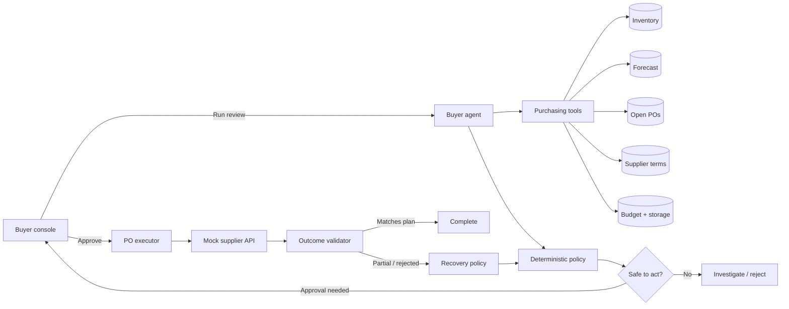

# AI Purchasing Agent

I built this project for the AI Purchasing Agent assignment. It reviews a purchase recommendation, gathers the information a buyer would normally check, decides whether the recommendation should be accepted or changed, and can create and validate a mock purchase order.

I chose to go deep on **Scenario 1 (Purchase Recommendation Review)** instead of implementing four shallow flows. After the order is created, the main demo deliberately continues into **Scenario 2**: the supplier only confirms part of the quantity, so the agent has to detect the shortfall and decide what to do next.

## The flow I implemented

1. The purchasing system recommends buying 800 units.
2. The agent checks inventory, forecast demand, open purchase orders, supplier terms, budget, and storage.
3. It calculates the actual requirement and returns `ACCEPT`, `MODIFY`, `REJECT`, or `INVESTIGATE` with its reasoning.
4. A buyer approves the proposed action when the spend is above the approval threshold.
5. The system checks the data again immediately before creating the PO.
6. It reads the supplier response back and validates what was actually confirmed.
7. If the result is different from the plan, the agent attempts a guarded recovery or escalates the case.

Every step is shown in the activity timeline, including the tool used and whether a guardrail passed.

## A design choice I made

I did not want the LLM to be responsible for purchasing arithmetic or financial controls.

The agent can choose which information tools to call and explain the decision, but the final quantity is calculated by a deterministic policy in `lib/policy.ts`. Before any write, `lib/executor.ts` runs the policy again using the latest data. If a model ever proposes something different from the policy result, the policy wins and the correction is added to the audit trail.

This keeps the flexible part of the workflow agentic while making the important controls easy to test and explain.

## Architecture



## How the quantity is calculated

The policy uses a small and explainable replenishment calculation:

```text
target stock = daily forecast × planning horizon + safety stock
net requirement = target stock − usable inventory − confirmed incoming POs
policy quantity = net requirement rounded to the supplier case pack
executable quantity = min(policy quantity, budget, storage, supplier capacity)
```

It also checks forecast confidence, MOQ, case-pack size, supplier capacity, budget, storage, existing orders, and the buyer approval threshold.

The possible decisions are:

- `ACCEPT`: the original recommendation matches the safe quantity.
- `MODIFY`: a purchase is needed, but the quantity should change.
- `REJECT`: an additional purchase is unnecessary or cannot be made safely.
- `INVESTIGATE`: the evidence is missing, stale, or not reliable enough to act on.

## The feedback loop

This is the part of the assignment I focused on most.

In the core scenario, the system recommends 800 units. After deducting usable inventory and a confirmed incoming PO, the agent changes the recommendation to **624 units**.

When the buyer approves it:

1. BluePeak Beverages receives a request for 624 units.
2. The mock supplier confirms only 250 units and declines the remainder.
3. The validator catches the 374-unit shortfall instead of treating the API call as success.
4. The recovery policy checks alternate suppliers.
5. AquaSource South can cover the gap, so the quantity is rounded to its 24-unit case pack and a second PO is created for 384 units.
6. The final validation confirms 634 units across both suppliers, which covers the 624-unit requirement with 10 units of pack rounding.

The recovery order is allowed only if it still fits the remaining budget and storage, respects supplier terms, and stays within a 5% spend tolerance covered by the buyer's original approval. Otherwise, the agent escalates instead of placing another order.

## Running it locally

You will need Node.js 20 or newer.

```bash
npm install
cp .env.example .env.local
npm run dev
```

Then open [http://localhost:3000](http://localhost:3000).

The app runs in deterministic demo mode by default, so an API key is not required. For the complete flow:

1. Select **Core demo**.
2. Click **Run agent review**.
3. Review the evidence, calculation, and constraint checks.
4. Click **Approve & execute**.
5. Follow the partial-confirmation and recovery steps in the activity timeline.

## Running with an OpenAI model

Live model mode is optional. Add these values to `.env.local`:

```bash
OPENAI_API_KEY=your_key_here
OPENAI_MODEL=gpt-5.4-mini
AGENT_MODE=openai
```

In live mode, the agent uses strict function tools through the Responses API. If the provider is unavailable, the application falls back to the same deterministic policy and records the fallback in the timeline.

No secrets should be committed. `.env.local` is ignored and `.env.example` documents the expected configuration.

## Test scenarios

| Scenario | Expected behaviour |
| --- | --- |
| Core demo | Modify 800 to 624, detect a 250-unit confirmation, and recover the shortfall |
| Accept | Accept the original 800-unit recommendation |
| Constrained | Reduce the quantity because budget and storage cannot support the full requirement |
| Investigate | Stop without creating a PO because the forecast is stale and low-confidence |

The detailed evaluation scorecard is in [docs/evaluation.md](docs/evaluation.md). I check the decision, required tool calls, constraint compliance, action, persisted supplier response, and recovery result separately so a failure is easy to diagnose.

## Tests

```bash
npm test
npm run typecheck
npm run build
```

The automated tests cover all four policy outcomes plus the full confirmation and partial-confirmation execution paths.

## API routes

| Route | What it does |
| --- | --- |
| `GET /api/scenarios` | Returns the mock purchasing scenarios |
| `POST /api/agent/run` | Investigates a scenario and produces a policy-validated decision |
| `POST /api/purchase-orders/execute` | Revalidates the plan, creates mock POs, checks the result, and recovers or escalates |
| `POST /api/reset` | Clears the in-memory demo state |

## Project structure

```text
app/                       Next.js pages and API routes
components/buyer-console  Buyer dashboard and workflow UI
lib/agent.ts               Tool-calling agent and deterministic fallback
lib/policy.ts              Purchasing calculations and constraints
lib/executor.ts            PO execution, validation, and recovery
lib/scenarios.ts           Mock data for the four evaluation cases
tests/                     Policy and execution tests
docs/evaluation.md         Evaluation approach and known limitations
```

## What I would add next

Given more time, I would replace the in-memory store with a transactional database, move each mock tool behind its own adapter, persist policy versions and input snapshots, and process supplier confirmations through idempotent webhook events. I would also add identity-backed approvals and a replayable evaluation dataset for regression testing.

For this assignment, I kept those pieces mocked so I could spend the time on the decision quality, safety boundaries, and feedback loop.
